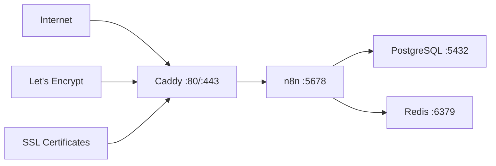

# n8n HTTPS Setup Guide

This guide explains how to configure HTTPS/TLS for your n8n deployment using Caddy as a reverse proxy with automatic SSL certificates from Let's Encrypt.

## Architecture Overview

The deployment now includes:
- **Caddy 2**: HTTPS reverse proxy with automatic SSL certificate management
- **n8n**: Workflow automation platform (behind proxy)
- **PostgreSQL 15**: Database
- **Redis 7**: Queue and cache



## Required Configuration

### 1. GitHub Repository Secrets

Configure these secrets in your GitHub repository (Settings → Secrets and variables → Actions):

#### Required Secrets:
```bash
N8N_DOMAIN                # Your domain name (e.g., "n8n.yourdomain.com")
N8N_ENCRYPTION_KEY        # Random 32+ character string for n8n encryption
POSTGRES_PASSWORD         # Strong password for PostgreSQL
```

#### Optional Secrets:
```bash
# Only needed if using custom email for Let's Encrypt
CADDY_EMAIL              # Email for Let's Encrypt certificates
```

### 2. Environment Variables

The workflow automatically configures these environment variables:

```yaml
# Ports
HTTPS_PORT: 443          # HTTPS port
HTTP_PORT: 80            # HTTP port (redirects to HTTPS)
CADDY_ADMIN_PORT: 2019   # Caddy admin API port

# Memory limits
CADDY_MEMORY: 256m       # Caddy memory limit
POSTGRES_MEMORY: 1536m   # PostgreSQL memory limit
REDIS_MEMORY: 512m       # Redis memory limit
N8N_MEMORY: 2560m        # n8n memory limit
```

## Setup Instructions

### 1. Domain Configuration

1. **Purchase/Configure Domain**: Get a domain name (e.g., `n8n.yourdomain.com`)

2. **DNS Configuration**: Point your domain to your server's public IP:
   ```
   Type: A Record
   Name: n8n (or your subdomain)
   Value: YOUR_SERVER_PUBLIC_IP
   TTL: 300 (or default)
   ```

3. **Verify DNS**: Test DNS resolution:
   ```bash
   nslookup n8n.yourdomain.com
   dig n8n.yourdomain.com
   ```

### 2. GitHub Secrets Configuration

1. Go to your repository: `Settings → Secrets and variables → Actions`

2. Add repository secrets:
   ```
   N8N_DOMAIN: n8n.yourdomain.com
   N8N_ENCRYPTION_KEY: your-random-32-plus-character-encryption-key-here
   POSTGRES_PASSWORD: your-strong-postgres-password-here
   ```

3. **Generate Encryption Key**:
   ```bash
   # Linux/macOS
   openssl rand -base64 32

   # Or use online generator (ensure it's 32+ characters)
   ```

### 3. Firewall Configuration

Ensure your server firewall allows these ports:

```bash
# UFW (Ubuntu/Debian)
sudo ufw allow 80/tcp      # HTTP
sudo ufw allow 443/tcp     # HTTPS
sudo ufw allow 2019/tcp    # Caddy admin (optional, for debugging)

# iptables
sudo iptables -A INPUT -p tcp --dport 80 -j ACCEPT
sudo iptables -A INPUT -p tcp --dport 443 -j ACCEPT
sudo iptables -A INPUT -p tcp --dport 2019 -j ACCEPT
```

### 4. Deploy

1. **Push changes** to trigger deployment:
   ```bash
   git add .
   git commit -m \"Add HTTPS support with Caddy reverse proxy\"
   git push origin main
   ```

2. **Monitor deployment** in GitHub Actions

3. **Verify SSL certificate**:
   ```bash
   # Check certificate
   curl -I https://n8n.yourdomain.com

   # Detailed SSL info
   openssl s_client -connect n8n.yourdomain.com:443 -servername n8n.yourdomain.com
   ```

## Security Features

### 1. Automatic SSL/TLS
- **Let's Encrypt**: Automatic certificate provisioning and renewal
- **HTTP to HTTPS**: Automatic redirection
- **HSTS**: HTTP Strict Transport Security headers
- **Security Headers**: XSS protection, clickjacking prevention, etc.

### 2. Network Security
- **Internal Network**: All services communicate on isolated Docker network
- **No Direct Exposure**: n8n is only accessible through Caddy proxy
- **Secure Cookies**: HTTPS-only cookies for n8n sessions

### 3. Content Security Policy
- **CSP Headers**: Prevent XSS attacks
- **Frame Protection**: Prevent clickjacking
- **Content Type Protection**: Prevent MIME sniffing

## Troubleshooting

### Common Issues

#### 1. DNS Not Resolving
```bash
# Check DNS propagation
dig n8n.yourdomain.com
nslookup n8n.yourdomain.com 8.8.8.8
```

#### 2. Let's Encrypt Certificate Issues
```bash
# Check Caddy logs
sudo podman logs n8n-caddy

# Common causes:
# - Domain not pointing to server
# - Port 80/443 blocked by firewall
# - Rate limiting from Let's Encrypt
```

#### 3. Service Not Accessible
```bash
# Check all containers
sudo podman ps

# Check specific service
sudo podman logs n8n-caddy
sudo podman logs n8n
sudo podman logs n8n-postgres
sudo podman logs n8n-redis
```

#### 4. Certificate Renewal Issues
```bash
# Force certificate renewal (if needed)
sudo podman exec n8n-caddy caddy reload --config /etc/caddy/Caddyfile
```

### Health Check Commands

```bash
# Check Caddy health
curl http://localhost:8080/health

# Check n8n through proxy
curl -k https://localhost/healthz

# Check all containers
sudo podman ps --format \"table {{.Names}}\\t{{.Status}}\\t{{.Ports}}\"
```

## Development vs Production

### Development (localhost)
- Uses HTTP on port 80
- Self-signed certificates for HTTPS testing
- No Let's Encrypt integration

### Production (real domain)
- Automatic HTTPS with Let's Encrypt
- HTTP redirects to HTTPS
- Full security headers
- Certificate auto-renewal

## Monitoring and Maintenance

### 1. Certificate Monitoring
```bash
# Check certificate expiry
echo | openssl s_client -connect n8n.yourdomain.com:443 2>/dev/null | openssl x509 -noout -dates
```

### 2. Log Monitoring
```bash
# Caddy access logs
sudo podman exec n8n-caddy tail -f /var/log/caddy/access.log

# Container logs
sudo podman logs -f n8n-caddy
```

### 3. Performance Monitoring
```bash
# Container stats
sudo podman stats n8n-caddy n8n n8n-postgres n8n-redis
```

## Security Best Practices

1. **Regular Updates**: Keep container images updated
2. **Strong Passwords**: Use strong, unique passwords for all services
3. **Access Control**: Limit access to admin ports (2019)
4. **Monitoring**: Monitor logs for suspicious activity
5. **Backups**: Regular backups of n8n data and PostgreSQL
6. **Firewall**: Only open necessary ports

## Additional Resources

- [Caddy Documentation](https://caddyserver.com/docs/)
- [Let's Encrypt Documentation](https://letsencrypt.org/docs/)
- [n8n Security Best Practices](https://docs.n8n.io/hosting/security/)
- [Podman Networking](https://docs.podman.io/en/latest/markdown/podman-network.1.html)